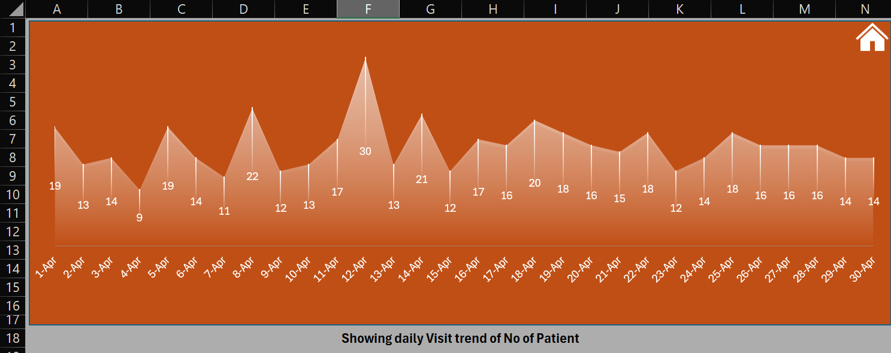
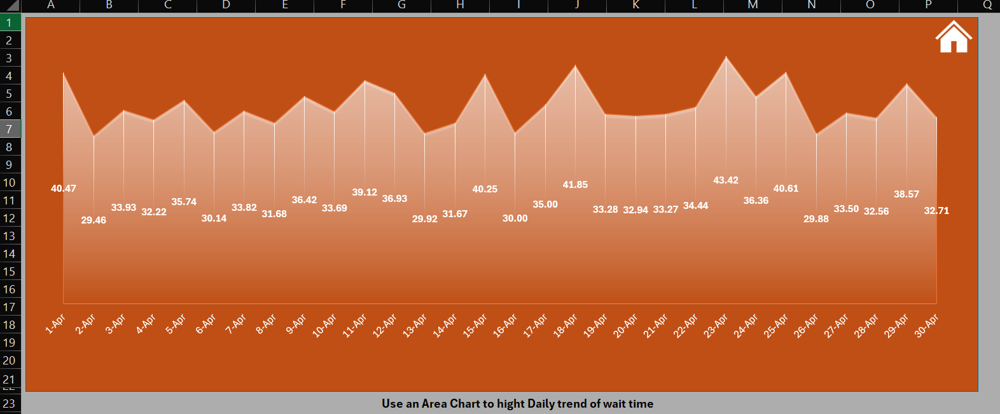
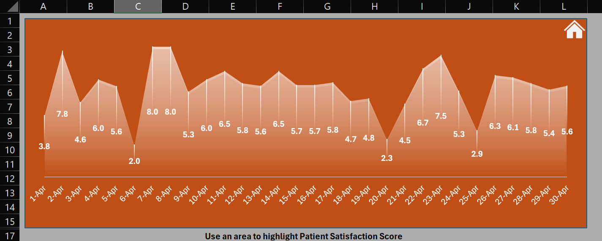

## Hospital Emergency Room Dashboard (Excel)
Excel Dashboard Project Analyzing Hospital Emergency Room Analysis

### Overview
This project analyzes Emergency Room (ER) patient data using Microsoft Excel. 
The dashboard provides insights into patient flow, wait times, admission status, 
department referrals, and satisfaction scores to support operational decision-making.

## 📊 Key Metrics
- Total Number of Patients
- Average Waiting Time
- Patient Satisfaction Score
- Admission vs Not Admitted Analysis
- Gender-wise Patient Distribution
- Age Group-wise Patient Analysis
- Department Referral Analysis

---

## 🛠 Tools & Techniques Used
- Microsoft Excel
- Pivot Tables & Pivot Charts
- Excel Formulas
- Slicers for interactivity
- Data Cleaning & Formatting
- Dashboard Design & Visualization

---

## 🔍 Key Insights
- More than **50% of patients were admitted** after ER consultation.
- **General Medicine** received the highest number of referrals.
- Majority of patients belonged to the **0–19** and **60–69** age groups.
- Average waiting time and satisfaction score help evaluate ER efficiency.

---

## 📂 Files Included
- excel_dashboard_hospital_emergency _room.xlsx

## 📸 Dashboard Preview

### Dashboard Overview

### Showing daily Visit trend of No of Patient

### Use an Area Chart to Highlight Daily trend of wait time 

### Use an Area to highlight Patient Satisfaction Score

---

## 🎯 Purpose of This Project
This project was created to demonstrate my **Excel data analysis, visualization, and dashboard design skills**.  
It reflects real-world healthcare analytics use cases and is suitable for business and operational reporting.

---

